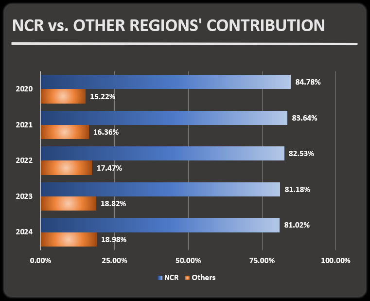
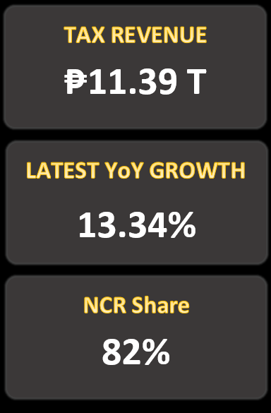
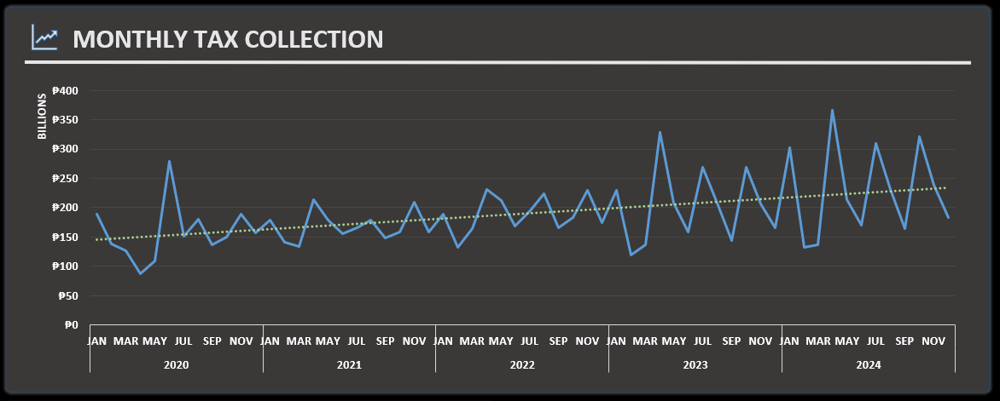
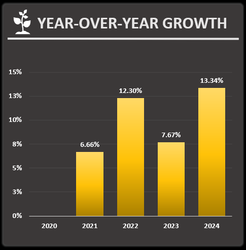
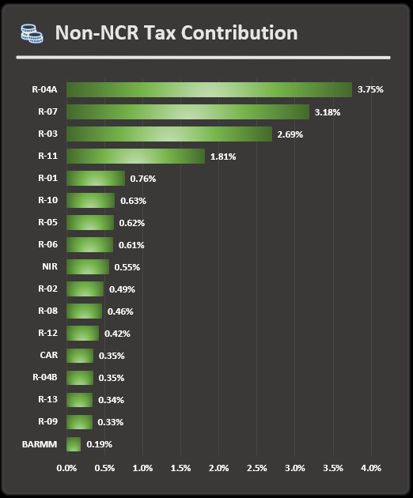
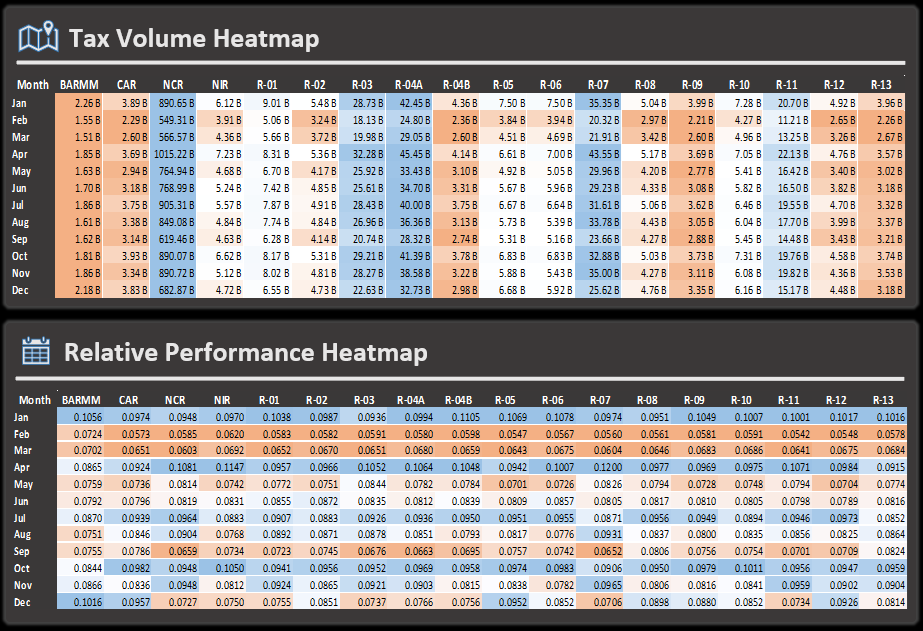

# Tax Revenue Dashboard (Excel Analytics Dashboard)


An Excel-based tax analytics dashboard using Power Query (data wrangling), pivot tables, and heatmaps to analyze regional trends and growth of a country's tax collection from year 2020–2024.

## 📌 Overview

This project analyzes multi-year tax collection data across regions in the Philippines from **2020 to 2024**. The objective is to identify growth trends, regional contributions, and potential expansion opportunities using Excel-based analytics.

The project demonstrates a full workflow from **raw data ingestion → transformation → analysis → dashboard visualization**.

---

## 📁 Project Structure

```text
tax-collection-dashboard/
│
├── data/
│   ├── raw/
│   │   ├── 2020.txt
│   │   ├── 2021.txt
│   │   ├── 2022.txt
│   │   ├── 2023.txt
│   │   └── 2024.txt
│   │
│   └── processed/
│       └── tax-data_cleaned.xlsx
│
├── dashboard/
│   └── tax_dashboard.xlsx
│
├── images/
│   ├── tax-revenue-dashboard.png
│   ├── annual-ncr-share.png
│   └── before-after.png
│   ├── kpi-cards.png
│   ├── monthly-tax-revenue.png
│   └── non-ncr-contribution.png
│   ├── revenue-yoy-growth.png
│   ├── volume-and-performance-heatmap.png
│
└── README.md
```

---

## 📁 Dataset

- Source: Raw `.txt` files (2020–2024)
- Data includes:
  - Date
  - Region
  - Tax Collected

- Original Data Source: [Open Data Portal by BetterGov.ph](https://data.bettergov.ph/datasets/20)

Data was combined and transformed using **Power Query in Excel**.

---

## 🔄 Data Processing

Raw tax data was provided as separate `.txt` files for each year (2020–2024). These files were consolidated and transformed using **Power Query in Excel**.

### Steps performed:

* Imported multiple `.txt` files from a folder
* Combined all files into a single dataset
* Standardized columns (Date, Region, Tax)
* Cleaned data:
  
  * Removed duplicates
  * Handled missing values
* Structured the dataset for analysis

The cleaned dataset (`tax-data_cleaned.xlsx`) serves as the foundation for all dashboard visualizations.

---

## ⚙️ Tools & Techniques

* **Microsoft Excel**
* **Power Query** (data transformation)
* **Pivot Tables** (aggregation and analysis)
* **Conditional Formatting** (heatmaps)
* **Dashboard Design** (KPI cards, charts)

---

## 📊 Dashboard Components

The Excel dashboard includes:

* 📈 **Monthly Trend (Line Chart)** — tracks tax growth over time
* 📉 **Year-over-Year Growth (Column Chart)** — measures annual performance
* 🥧 **NCR vs Others (Pie Chart)** — highlights revenue concentration
* 📊 **Regional Breakdown (Bar Chart)** — compares non-NCR regions contribution to country's tax revenue
* 🔥 **Heatmaps**:

  * Tax Volume (Absolute values)
  * Relative Performance (Normalized by region average) 
* 🧾 **KPI Cards**:

  * Total Tax
  * Latest YoY Growth
  * NCR Share

---

## 🔍 Key Insights

* 📈 Total tax grew by **46% from 2020 to 2024**, with the highest growth in **2024 (+13.34% from 2023 revenue)**
* 🥧 NCR contributes **approximately 82% of total tax revenue for the whole 5 years of data**, indicating heavy concentration towards the region. This also shows that **the country relies 80% of its tax revenue in NCR every year**.

  



* 📊 Significant drop-off after NCR, with the next largest region contributing less than **4%**
* 🚀 Regions **Regions IV-A (CALABARZON), VII (Central Visayas), and III (Central Luzon)** show strong expansion potential
* ⚠️ Several regions contribute less than **1%**, highlighting underdeveloped areas

---

## 🧠 Key Learnings

* Built an end-to-end data pipeline using **Power Query**
* Designed a structured and interactive **Excel dashboard**
* Applied **data normalization techniques** for deeper insights
* Translated raw data into **business-relevant insights**

---

## 📸 Dashboard Preview

### Overview




### Growth & Composition


### Regional Breakdown


### Heatmaps


---

## 🚀 How to Use

1. Open `dashboard/tax_dashboard.xlsx`
2. Refresh Power Query if prompted
3. Use slicers (if available) to explore data dynamically

---

## 📌 Future Improvements

* Migrate dashboard to **Power BI** for enhanced interactivity
* Automate data refresh pipeline
* Add forecasting and trend projection models
  
---

## 👤 Author

**Kim Singson**


Aspiring Data Analyst

---
